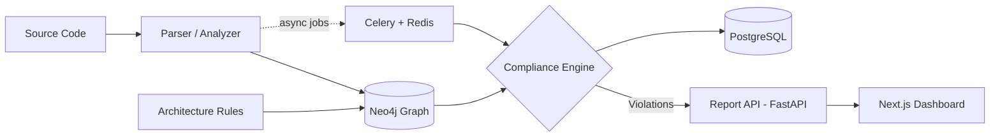
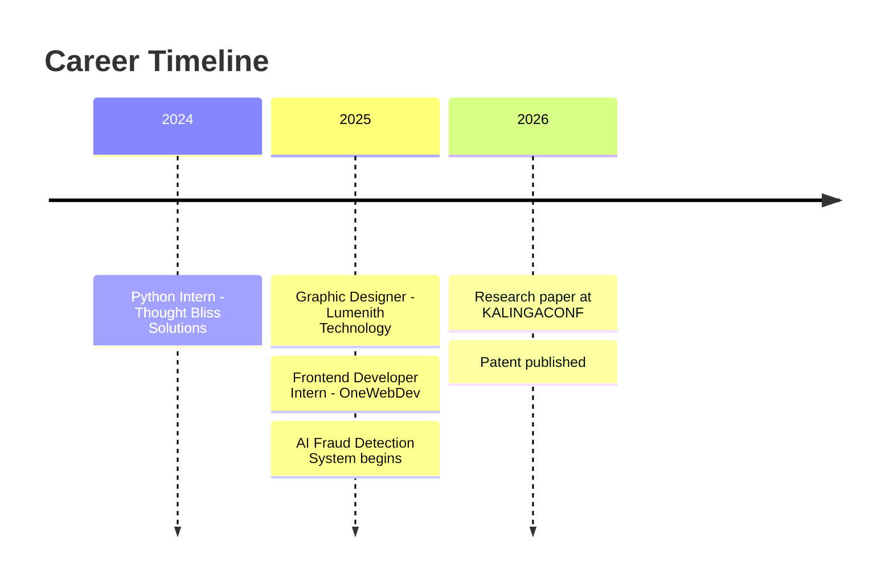

<!-- ═══════════════ HEADER ═══════════════ -->
<div align="center">


<a href="https://git.io/typing-svg">
  
</a>

<br/>

<a href="https://linkedin.com/in/sanket-patekar"></a>
<a href="mailto:sanketpatekar03@gmail.com"></a>
<a href="https://github.com/sanketpatekar08"></a>
<a href="https://wa.me/918261030840"></a>

<br/><br/>


</div>

---

## 👨‍💻 About Me

```js
const sanket = {
  role: "Full Stack Developer",
  education: "B.Tech CSE @ Vishwakarma Institute of Technology, Pune",
  gpa: 8.67,
  diploma: "Computer Technology @ Sanjivani K.B.P. Polytechnic (94.57%)",
  focus: ["Responsive Web Apps", "REST APIs", "AI/ML Integration", "Database-driven Systems"],
  currentlyBuilding: ["AI Fraud Detection System", "AI Architecture Governance Platform"],
  alsoDo: ["Graphic Design", "Research", "Patent contributions"],
  funFact: "I design the UI and code it too 🎨 → 💻",
};
```

- 🎓 **B.Tech CSE** student with strong CS fundamentals (DSA, OOP, DBMS, OS, CN)
- 🚀 Build **responsive web apps, REST APIs and reusable UI components**
- 🧠 Exploring **AI/ML inside full-stack products** with FastAPI, PyTorch and Next.js
- 🔬 Presented research at **KALINGACONF 2026** and contributed to an **Indian patent**

---

## 🛠️ Tech Arsenal

<div align="center">

**Languages**


**Frontend**


**Backend & Realtime**


**Databases**


**AI / ML**


**Tools & Design**


</div>

<details>
<summary><b>📚 Concepts & protocols I work with</b></summary>
<br/>

`REST APIs` · `WebSockets` · `HTTP/HTTPS` · `IPv4/IPv6` · `Celery task queues` · `Graph databases` · `Agile / Scrum` · `Software Testing` · `Cross-browser compatibility`

</details>

---

## 🔥 Featured Projects

<table>
<tr>
<td width="50%" valign="top">

### 🏛️ AI Architecture Governance Platform
Validates software architecture against real source code using **graph-based compliance analysis**.

- Neo4j graph model of code ↔ architecture rules
- Async processing with **Celery + Redis**
- Persistent storage in **PostgreSQL**

`FastAPI` `Next.js` `Neo4j` `PostgreSQL` `Redis` `Celery` `PyTorch`

<a href="https://github.com/sanketpatekar08"></a>

</td>
<td width="50%" valign="top">

### 🛡️ AI Fraud Detection System
Phishing & fraud detection for a **fundraising platform serving US clients**.

- ML models for **email and website** phishing detection
- Live **React (Vite) dashboard** for results
- FastAPI inference backend

`Python` `FastAPI` `React (Vite)` `ML`

<a href="https://github.com/sanketpatekar08"></a>

</td>
</tr>
<tr>
<td width="50%" valign="top">

### 💰 AI Expense Tracker
Smart expense management with **secure authentication** and AI insights.

- Automatic expense categorization
- Budget tracking and spending insights via **Gemini API**
- Full MERN-style stack

`React.js` `Node.js` `MongoDB` `Gemini API`

<a href="https://github.com/sanketpatekar08"></a>

</td>
<td width="50%" valign="top">

### 🔬 ETA-Sync *(Research)*
**DTW-Guided Cross Attention** for robust asynchronous multi-modal sensor fusion on edge devices.

- Presented at **KALINGACONF 2026**
- Focus: AI, edge computing, sensor fusion

`Deep Learning` `Edge AI` `Research`

</td>
</tr>
</table>

### 🧩 How the Architecture Governance Platform works



---

## 💼 Experience



| Role | Company | Location | Highlights |
|------|---------|----------|-----------|
| 🖥️ **Frontend Developer Intern** | OneWebDev | Shrirampur | Reusable UI components, performance optimization, REST API integration, cross-browser support · `HTML` `CSS` `JS` `TS` `Bootstrap` `React` |
| 🎨 **Graphic Designer** | Lumenith Technology | Pune | Social media creatives for client brands to boost brand identity · `Photoshop` `Illustrator` `Canva` `CorelDraw` `After Effects` |
| 🐍 **Python Intern** | Thought Bliss Solutions | Pune | Python data structures and a database-driven project for efficient data management · `Python` `Pandas` `PyTorch` |

---

## 🏆 Research, Patent & Achievements

| | Achievement |
|---|---|
| 📄 **Research Paper** | *ETA-Sync: DTW-Guided Cross Attention for Robust Asynchronous Multi-Modal Sensor Fusion on Edge Devices* — presented at **KALINGACONF 2026** |
| 🧾 **Patent** | Contributor, Indian Patent Application **202621082654** — *A Tamper Proof Pharmaceutical Container Security* (published 04 Sep 2026) |


---

## 📊 GitHub Analytics

<div align="center">


</div>

---

## 🎯 Currently

- 🔭 Building **AI-driven full-stack products** end to end
- 🌱 Learning: **Go, Kafka, Spring Boot** and system design
- 🤝 Open to **internships, freelance and collaboration** on web + AI projects
- 💬 Ask me about: **React, Node.js, FastAPI, graph databases**

---

## 📫 Let's Connect

<div align="center">

<a href="https://linkedin.com/in/sanket-patekar"></a>
<a href="mailto:sanketpatekar03@gmail.com"></a>
<a href="https://github.com/sanketpatekar08"></a>

<br/><br/>

<i>“Code is design in motion.”</i> ✨


</div>
