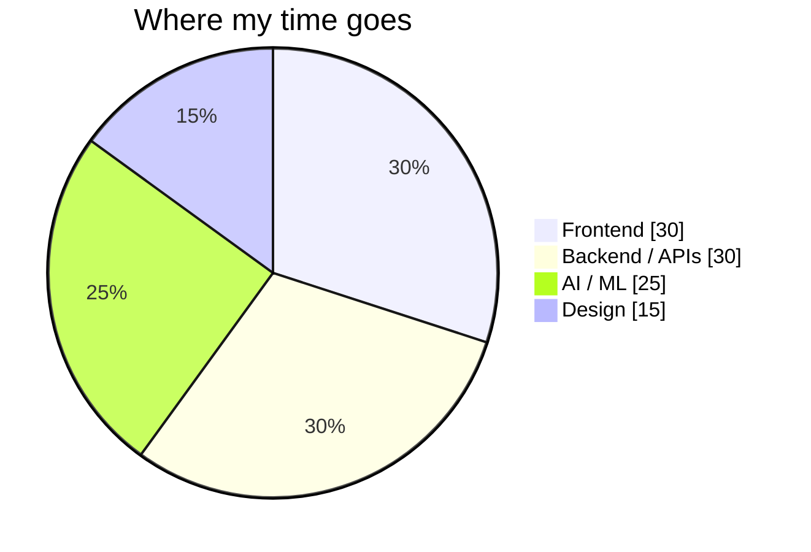
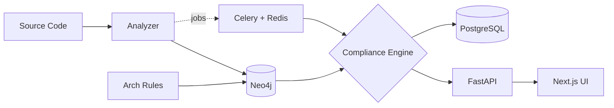

<div align="center">


<br/><br/>

<a href="https://linkedin.com/in/sanket-patekar"></a>
<a href="mailto:sanketpatekar03@gmail.com"></a>
<a href="https://wa.me/918261030840"></a>

</div>

<br/>

```ansi
 sanket@pune ~ $ neofetch
 ┌──────────────────────────────────────────────────────────────┐
   OS ........... B.Tech CSE @ Vishwakarma Institute of Tech
   GPA .......... 8.67  |  Diploma 94.57%
   Role ......... Full Stack Developer
   Stack ........ React · Node · TypeScript · FastAPI · Next.js
   AI ........... PyTorch · ML · Edge AI · Gemini API
   DB ........... PostgreSQL · MongoDB · Neo4j · Redis · MySQL
   Research ..... KALINGACONF 2026 (ETA-Sync)
   Patent ....... IN 202621082654 (published 04 Sep 2026)
   Status ....... Open to internships & full-time roles 🟢
 └──────────────────────────────────────────────────────────────┘
```

<br/>

## `01` &nbsp;// about

<table>
<tr>
<td width="60%" valign="top">

I build **responsive web apps, REST APIs and database-driven systems**, then wire **AI/ML** into them so they do something useful.
I work across the stack, from pixel-level UI (I'm also a graphic designer 🎨) to graph-based backends and async task pipelines.

- 🧱 Reusable component-driven frontends
- ⚙️ Scalable backends with queues and caches
- 🧠 ML models served through FastAPI
- 🔬 Published research and patent contributions

</td>
<td width="40%" valign="top">



</td>
</tr>
</table>

<br/>

## `02` &nbsp;// stack

<div align="center">

| Layer | Tools |
|:--:|:--|
| 🖥️ **Frontend** |         |
| ⚙️ **Backend** |       |
| 🗄️ **Data** |      |
| 🧠 **AI / ML** |      |
| 🔤 **Languages** |      |
| 🧰 **Tools** |        |

</div>

<br/>

## `03` &nbsp;// projects

<details open>
<summary><b>🏛️ &nbsp;AI Architecture Governance Platform</b> &nbsp;·&nbsp; <code>FastAPI</code> <code>Next.js</code> <code>Neo4j</code></summary>
<br/>

> Validates software architecture against actual source code using **graph-based compliance analysis**.

- Models code and architecture rules as a **Neo4j graph** to detect drift and violations
- **Celery + Redis** run heavy analysis jobs asynchronously
- **PostgreSQL** stores reports and history; **Next.js** dashboard visualises results



**Stack:** `FastAPI` `Next.js` `Neo4j` `PostgreSQL` `Redis` `Celery` `PyTorch`
&nbsp;[](https://github.com/sanketpatekar08)

</details>

<details>
<summary><b>🛡️ &nbsp;AI Fraud Detection System</b> &nbsp;·&nbsp; <code>Python</code> <code>FastAPI</code> <code>React</code></summary>
<br/>

> Phishing & fraud detection for a **fundraising platform serving US clients**.

- ML models classify **emails and websites** as phishing or legitimate
- FastAPI inference service + **React (Vite)** dashboard for real-time results

**Stack:** `Python` `FastAPI` `React (Vite)` `ML`
&nbsp;[](https://github.com/sanketpatekar08)

</details>

<details>
<summary><b>💰 &nbsp;AI Expense Tracker</b> &nbsp;·&nbsp; <code>React</code> <code>Node.js</code> <code>MongoDB</code></summary>
<br/>

> Expense tracking with secure auth and AI-powered insights.

- Automatic **expense categorization** and **budget tracking**
- Spending insights generated with the **Gemini API**

**Stack:** `React.js` `Node.js` `MongoDB` `Gemini API`
&nbsp;[](https://github.com/sanketpatekar08)

</details>

<details>
<summary><b>🔬 &nbsp;ETA-Sync (Research)</b> &nbsp;·&nbsp; <code>Deep Learning</code> <code>Edge AI</code></summary>
<br/>

> **DTW-Guided Cross Attention for Robust Asynchronous Multi-Modal Sensor Fusion on Edge Devices**

- Presented at **KALINGACONF 2026**
- Explores multi-modal sensor fusion under asynchronous data on resource-constrained edge hardware

</details>

<br/>

## `04` &nbsp;// experience

```diff
+ Frontend Developer Intern   @ OneWebDev, Shrirampur          [ Sep 2025 – Dec 2025 ]
    reusable UI components · performance tuning · REST API integration · cross-browser support
    React · TypeScript · JavaScript · Bootstrap · HTML/CSS

+ Graphic Designer            @ Lumenith Technology, Pune      [ Aug 2025 – Sep 2025 ]
    social media creatives for client brands · brand identity
    Photoshop · Illustrator · Canva · CorelDraw · After Effects

+ Python Intern               @ Thought Bliss Solutions, Pune  [ Jun 2024 – Jul 2024 ]
    Python data structures · database-driven project for data management
    Python · Pandas · PyTorch
```

<br/>

## `05` &nbsp;// achievements

<table>
<tr>
<td align="center" width="33%">
<h3>📄</h3>
<b>Research Paper</b><br/>
<sub>ET
